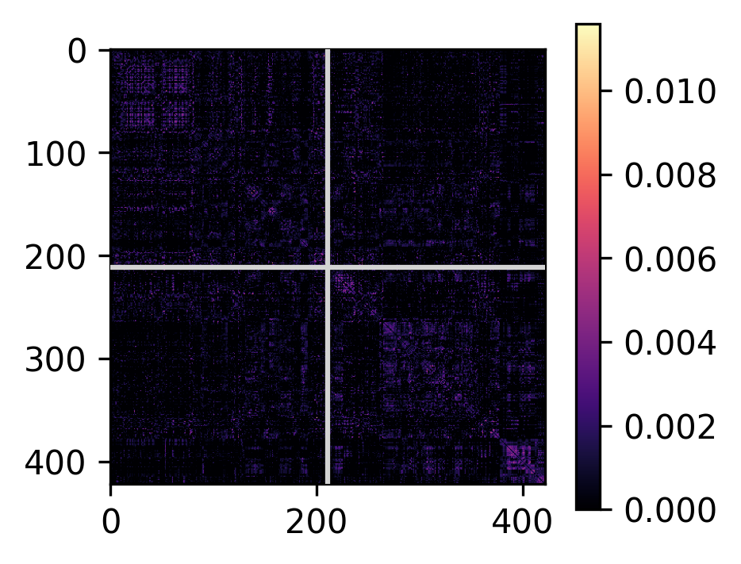
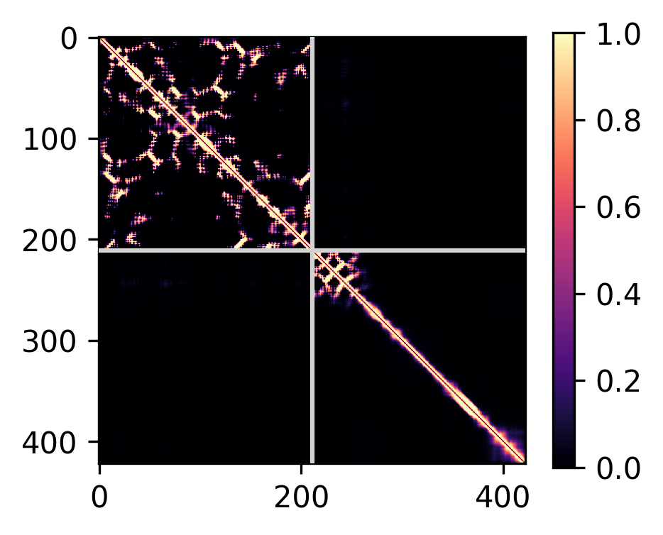
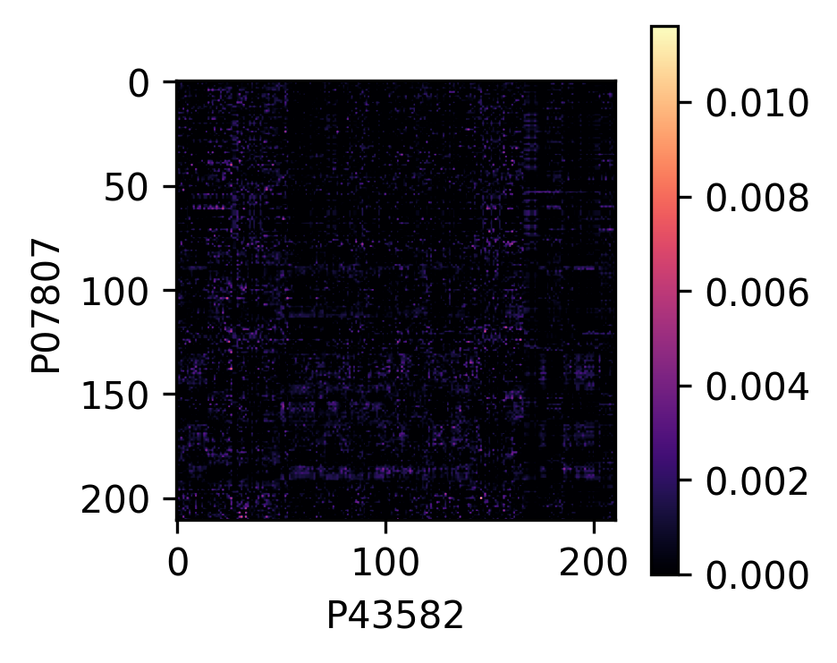
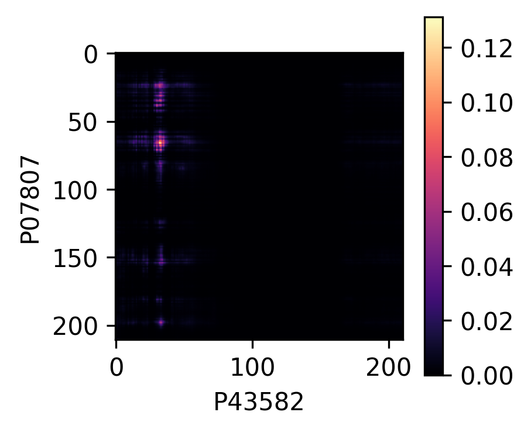

# 🍐 yunta


Predicting a pairwise protein-protein interactions and structures from multiple sequence alignments.

- [Installation](#installation)
- [Credit](#credit)
- [Command-line usage](#command-line-usage)
    - [Generating multiple-sequence alignments](#generating-multiple-sequence-alignments)
    - [Calculating contact maps](#calculating-contact-maps)
    - [Predicting protein complex structures]
    - [Command-line tools](#command-line-tools)
- [Python API](#python-api)
- [Scaling up](#-if-you-want-to-scale-up)
- [Issues, problems, suggestions](#issues-problems-suggestions)
- [Further help](#further-help)

**`yunta`** provides several implementations of protein-protein interaction evaluation. In increasing computational cost:

- GPU-accelerated direct coupling analysis (DCA) (in Tensorflow and PyTorch)
- [RoseTTAFold](https://github.com/RosettaCommons/RoseTTAFold)-2track via the `rf2t-micro` package
- [AlphaFold2](https://github.com/google-deepmind/alphafold) for protein-protein structure prediction

`yunta` has streamlined installation, a command-line interface, a Python API, and some resilience to GPU out-of-memory error (though CPU-fallback). It takes as input unpaired multiple-sequence alignments in A3M format (as generated by tools like [`hhblits`](https://github.com/soedinglab/hh-suite)), and outputs a matrix of inter-residue contacts.

Rough timings for a pair of ~200 amino-acid proteins (_S. cerevisiae_ DHFR and WW domain-containing protein) on CPU:

- **DCA**: 5 seconds



- **RF2t**: 10 seconds



- **AlphaFold2**: 1 hour


## Installation

Obtaining and setting up `yunta` is easy.

```bash
$ pip install git+https://github.com/scbirlab/yunta
```

Using the embedded model requires using the [RoseTTAFold](https://github.com/RosettaCommons/RoseTTAFold)-2track and AlphaFold2 weights. These are automatically downloaded, but by using `yunta` you agree that the trained weights for RoseTTAFold are made available for non-commercial use only under the terms of the [Rosetta-DL Software license](https://files.ipd.uw.edu/pub/RoseTTAFold/Rosetta-DL_LICENSE.txt) and AlphaFold2's pretrained parameters fall under the [CC BY 4.0 license](https://creativecommons.org/licenses/by/4.0/legalcode).

## Credit

`yunta` is a fork of [SpeedPPI](https://www.biorxiv.org/content/10.1101/2023.04.15.536993v1), which is itself inspired by [FoldDock](https://www.nature.com/articles/s41467-022-28865-w). This method used AlphaFold2 to evaluate 65,484 protein-protein interactions from the human proteome in [Towards a structurally resolved human protein interaction network](https://www.nature.com/articles/s41594-022-00910-8).

The idea of using DCA, [RoseTTAFold](https://github.com/RosettaCommons/RoseTTAFold)-2track, and [AlphaFold2](https://github.com/google-deepmind/alphafold) in a cascade of increasingly expensive and specific PPI detection methods has been explored in a series of papers from David Baker's lab:

- [Cong et al., Protein interaction networks revealed by proteome coevolution. _Science_, 2019](https://doi.org/10.1126/science.aaw6718)
- [Humpreys et al., Computed structures of core eukaryotic protein complexes. _Science_, 2021](https://doi.org/10.1126/science.abm4805)
- [Humpreys et al., Protein interactions in human pathogens revealed through deep learning. _Nature Microbiology_, 2024](https://doi.org/10.1038/s41564-024-01791-x)

`yunta` puts these algorithms in one place with easy installation, a command-line interface, and a Python API.

## Command-line usage 

You can always get more help by running

```bash
$ yunta --help
usage: yunta [-h] {dca-single,dca-many,rf2t-single,af2-single,af2-many} ...

Screening protein-protein interactions using DCA and AlphaFold2.

options:
  -h, --help            show this help message and exit

Sub-commands:
  {dca-single,dca-many,rf2t-single,af2-single,af2-many}
                        Use these commands to specify the tool you want to use.
    dca-single          Calculate DCA for one protein-protein interaction.
    dca-many            Calculate DCA between two sets of proteins, or all pairs in one set of proteins.
    rf2t-single         Calculate RF-2track contacts for between one protein and a series of others.
    af2-single          Model one protein-protein interaction.
    af2-many            Model all interactions between two sets of proteins, or all pairs in one set of proteins.
```

### Generating multiple-sequence alignments

All the algorithms depend on pre-computed multiple-sequence alignments (MSAs) between a protein of interest and as many other proteins as possible. This allows computations to be sped up by separating out this phase of the calculation. You can generate MSAs using a dedicated tool like [`hhblits`](https://github.com/soedinglab/hh-suite), which will speed up the process by using pre-clustered datasbes like UniClust. We typically use a command like:

```bash
hhblits -e 0.01 -v 3 -d /path/to/UniClust-database -i input.fasta -oa3m output-msa.a3m -o /dev/null -cov 60 -n 3 -realign -realign_max 10000
```

In our experience, this can take 1-40 min depending on the complexity of the query. Check the [`hhsuite`](https://github.com/soedinglab/hh-suite) documentation for more details.

Once you have your MSAs, you can use the information contained within them using tools in `yunta` to calculate contact maps and predict structures of protein complexes with AlphaFold2.

### Calculating contact maps

Given two MSAs, `yunta` will calculate the contact map using DCA, RF2t, or AlphaFold2, and produce a summary table for each pair provided as input. 

Using DCA or RF2t will produce a table like this:

```bash
$ yunta dca-single test/inputs/DYR_YEAST.a3m -2 test/inputs/CAPZA_YEAST.a3m -o test/outputs/dca-single.tsv --apc
```

| ID | uniprot_id_1	| uniprot_id_2 | seq_len | chain_a_len	| chain_b_len	| msa1_depth	| msa2_depth	| msa_depth	| n_eff	| apc	| mean | median | maximum	| minimum |
| -- | ------------ | ------------ | ------- | ------------ | ----------- | ----------- | ----------- | ---------	| ----- | ---	| ---- | ------ | -------- | ------- |
O13297-D6VTK4	| O13297 | D6VTK4 | 980	| 549	| 431	| 14246	| 1546 | 670	| 2	| False	| 0.01830857 | 0.014683756 | 0.07428725	| 2.284808e-06 |

If you also give the `--plot` option, then the contact maps for the entore complex and only the inter-chain contacts will be saved, along with CSV files containing the numerical values as matrix. For example,

```bash
$ yunta dca-single test/inputs/DYR_YEAST.a3m -2 test/inputs/CAPZA_YEAST.a3m -o test/outputs/dca-single.tsv --apc --plot test/outputs/DYR_YEAST-CAPZA_YEAST
```




| 0 | 1 | 2 | ... | 420 | 421 |
| - | - | - | --- | --- | --- |
| -0.0 | 0.0009014737 | 0.0010275221 | ... | 0.0005961701 | -1.9190367e-05 | 
`...`

### Predicting protein complex structures

`yunta` can also feed your MSAs into the AlphaFold2 model to predict structures of binary protein complexes.

```bash
$ yunta af2-single test/inputs/DYR_YEAST.a3m -2 test/inputs/CAPZA_YEAST.a3m -o test/outputs/af2-single
```

This will also generate a table


Using `--plot` will generate the contact maps as with the other commands.

```bash
$ yunta af2-single test/inputs/DYR_YEAST.a3m -2 test/inputs/CAPZA_YEAST.a3m -o test/outputs/af2-single --plot test/outputs/af2-single-plot
```





### Command-line tools

You can run 1-vs-many with the `*-single` commands. For example:

```bash
$ yunta dca-single --help
usage: yunta dca-single [-h] [--msa2 [MSA2 ...]] [--list-file] [--output [OUTPUT]] [--plot PLOT] [--apc] [msa1]

positional arguments:
  msa1                  MSA file. Default: STDIN.

options:
  -h, --help            show this help message and exit
  --msa2 [MSA2 ...], -2 [MSA2 ...]
                        Second MSA file(s). Default: if not provided, all pairwise from msa1.
  --list-file, -l       Treat inputs as plain-text list of MSA files, rather than MSA filenames. Default: treat as MSA filenames.
  --output [OUTPUT], -o [OUTPUT]
                        Output filename. Default: STDOUT.
  --plot PLOT, -p PLOT  Directory for saving plots. Default: don't plot.
  --apc, -a             Whether to use APC correction in DCA. Default: don't apply correction.
```

If one MSA is provided, then homodimeric interactions are probed. For convenience, you can use the `--list-file` option to provide a single file containing a list of MSA files (one per line).

You can run many-vs-many with the `*-many` commands. For example:

```bash
$ yunta af2-many --help
usage: yunta af2-many [-h] [--msa2 [MSA2 ...]] [--list-file] --output OUTPUT [--params PARAMS] [--recycles RECYCLES] [--plot PLOT] [msa1 ...]

positional arguments:
  msa1                  MSA file(s). Default: "<_io.TextIOWrapper name='<stdin>' mode='r' encoding='utf-8'>".

options:
  -h, --help            show this help message and exit
  --msa2 [MSA2 ...], -2 [MSA2 ...]
                        Second MSA file(s). Default: if not provided, all pairwise from msa1.
  --list-file, -l       Treat inputs as plain-text list of MSA files, rather than MSA filenames. Default: treat as MSA filenames.
  --output OUTPUT, -o OUTPUT
                        Output directory. Required.
  --params PARAMS, -w PARAMS
                        Path to AlphaFold2 params file (.npz).
  --recycles RECYCLES, -x RECYCLES
                        Maximum number of recyles through the model. Default: "10".
  --plot PLOT, -p PLOT  Directory for saving plots. Default: don't plot.
```

## Python API

We provide an API for using MSAs in your own programs. 

```python
>>> from yunta.structs.msa import *
>>> msa = MSA.from_file("my-msa-file.a3m")
>>> msa.neff()
6
```

We also provide a reusable GPU-accelerated Tensorflow implementation of DCA (adapted from [Humpreys, _Science_, 2021](https://doi.org/10.1126/science.abm4805)).

```python
>>> from yunta.dca import calculate_dca
>>> from yunta.structs.msa import *
>>> paired_msa = PairedMSA.from_file("my-msa-file1.a3m", "my-msa-file2.a3m")
>>> calculate_dca(paired_msa, apc=True, gpu=False)
```

In case you prefer, you can also import a PyTorch implementation (which anecdotally is faster on both CPU and GPU).

```python
>>> from yunta.dca_torch import calculate_dca
>>> from yunta.structs.msa import *
>>> paired_msa = PairedMSA.from_file("my-msa-file1.a3m", "my-msa-file2.a3m")
>>> calculate_dca(paired_msa, apc=True, gpu=False)
```

(More documentation coming soon!)

## ... if you want to scale up

While the `*-many` commands can deal with processing multiple possible protein-protein interactions, if you want to screen more than a few and have access to a HPC cluster then using our [`nf-ggi` Nextflow pipeline](https://github.com/scbirlab/nf-ggi) will be more efficient. 

## Issues, problems, suggestions

Add to the [issue tracker](https://www.github.com/scbirlab/yunta/issues).

## Further help

- [RoseTTAFold](https://github.com/RosettaCommons/RoseTTAFold)
- [AlphaFold2](https://github.com/google-deepmind/alphafold)
- [rf2t-micro](https://github.com/scbirlab/rf2t-micro)
- [hhblits](https://github.com/soedinglab/hh-suite)